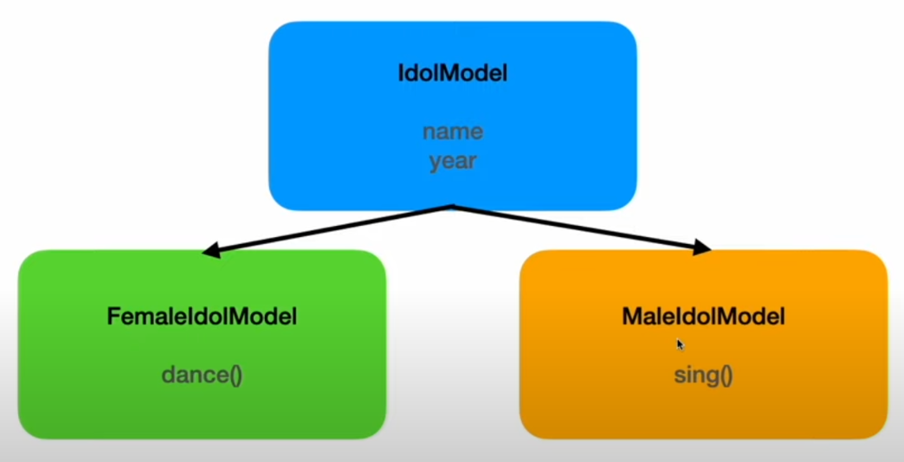

공통 부분 클래스 정의 → 추가 속성 클래스 설정

```jsx
class IdolModel{
    name;
    year;

    constructor(name, year){
        this.name = name;
        this.year = year;
    }
}

class FemaleIdolModel extends IdolModel{
    dance(){
        return `${this.name}(${this.year})이 춤을 춥니다.`;
    }

    sing(){
        return `${this.name}(${this.year})이 노래를 부릅니다.`
    }
}

class MaleIdolModel extends IdolModel{
    dance(){
        return `${this.name}(${this.year})이 춤을 춥니다.`;
    }

    sing(){
        return `${this.name}(${this.year})이 노래를 부릅니다.`
    }
}

const yuJin = new FemaleIdolModel('안유진', 2023);
const jiMin = new MaleIdolModel('지민', 1995);

console.log(yuJin);
console.log(yuJin.dance());
console.log(yuJin.sing());

console.log();

console.log(jiMin);
console.log(jiMin.dance());
console.log(jiMin.sing());
```

```jsx
FemaleIdolModel { name: '안유진', year: 2023 }
안유진(2023)이 춤을 춥니다.
안유진(2023)이 노래를 부릅니다.

MaleIdolModel { name: '지민', year: 1995 }
지민(1995)이 춤을 춥니다.
지민(1995)이 노래를 부릅니다.
```

### Class 다이어그램

```jsx
						                    +---------------------+
						                    |     IdolModel       |
						                    +---------------------+
						                    | - name              |
						                    | - year              |
						                    +---------------------+
						                    | + constructor(name, |
						                    |   year)             |
						                    +---------------------+
					                          /             \
					                         /               \
					            +--------------------+   +-------------------+
					            | FemaleIdolModel     |   | MaleIdolModel     |
					            +---------------------+   +-------------------+
					            | + dance()           |   | + dance()         |
					            | + sing()            |   | + sing()          |
					            +---------------------+   +-------------------+
								                 |                          |
								   +------------------------+     +-----------------------+
								   | yuJin: FemaleIdolModel  |     | jiMin: MaleIdolModel  |
								   +-------------------------+     +-----------------------+
								   | name = '안유진'          |     | name = '지민'         |
								   | year = 2023             |     | year = 1995           |
								   +-------------------------+     +-----------------------+

```

## Instanceof

```jsx
class IdolModel{
    name;
    year;

    constructor(name, year){
        this.name = name;
        this.year = year;
    }
}

class FemaleIdolModel extends IdolModel{
    dance(){
        return `${this.name}(${this.year})이 춤을 춥니다.`;
    }

    sing(){
        return `${this.name}(${this.year})이 노래를 부릅니다.`
    }
}

class MaleIdolModel extends IdolModel{
    dance(){
        return `${this.name}(${this.year})이 춤을 춥니다.`;
    }

    sing(){
        return `${this.name}(${this.year})이 노래를 부릅니다.`
    }
}

const yuJin = new FemaleIdolModel('안유진', 2023);
const jiMin = new MaleIdolModel('지민', 1995);

console.log('yuJin instanceof IdolModel =', yuJin instanceof IdolModel);
console.log('jiMin instanceof IdolModel =', jiMin instanceof IdolModel);
console.log('yuJin instanceof FemaleIdolModel =', yuJin instanceof FemaleIdolModel);
console.log('jiMin instanceof MaleIdolModel=', jiMin instanceof MaleIdolModel);

console.log('yuJin instanceof MaleIdolModel = ', yuJin instanceof MaleIdolModel);
console.log('jiMin instanceof FemaleIdolModel = ', jiMin instanceof FemaleIdolModel);
```

```jsx
yuJin instanceof IdolModel = true
jiMin instanceof IdolModel = true
yuJin instanceof FemaleIdolModel = true
jiMin instanceof MaleIdolModel= true
yuJin instanceof MaleIdolModel =  false
jiMin instanceof FemaleIdolModel =  false
```

## Super

```jsx
class IdolModel{
    name;
    year;

    constructor(name, year){
        this.name = name;
        this.year = year;
    }
}

class MaleIdolModel extends IdolModel{
    part;

    constructor(name, year, part){
        this.name = name;
        this.year = year;
        this.part = part;
    }
}

const RM = new MaleIdolModel('랩몬스터', 1994, 'Rap');
console.log(RM);
```

```jsx
ReferenceError: Must call super constructor in derived class before accessing 'this' or returning from derived constructor
// 'this'에 액세스하거나 파생 생성자에서 반환하기 전에 파생 클래스에서 수퍼 생성자를 호출해야 합니다.
```

super를 호출해야함

```jsx
class IdolModel{
    name;
    year;

    constructor(name, year){
        this.name = name;
        this.year = year;
    }
}

class MaleIdolModel extends IdolModel{
    part;

    constructor(name, year, part){
        super(); // IdolModel를 호출한것과 같다.
        this.name = name;
        this.year = year;
        this.part = part;
    }
}

const RM = new MaleIdolModel('랩몬스터', 1994, 'Rap');
console.log(RM);
```

```jsx
MaleIdolModel { name: '랩몬스터', year: 1994, part: 'Rap' }
```

부모 클래스를 상속받아 부모 필드를 상속 받으면 this를 사용하지 않고 super만 사용하여 표현할 수 있다.

```jsx
class IdolModel{
    name;
    year;

    constructor(name, year){
        this.name = name;
        this.year = year;
    }
}

class MaleIdolModel extends IdolModel{
    part;

    constructor(name, year, part){
        super(name, year); // IdolModel를 호출한것과 같다.
        this.part = part;
    }
}

const RM = new MaleIdolModel('랩몬스터', 1994, 'Rap');
console.log(RM);
```

```jsx
MaleIdolModel { name: '랩몬스터', year: 1994, part: 'Rap' }
```

```jsx
class IdolModel{
    name;
    year;

    constructor(name, year){
        this.name = name;
        this.year = year;
    }

    sayHello(){
        return `안녕하세요 ${this.name} 입니다.`
    }
}

class MaleIdolModel extends IdolModel{
    part;

    constructor(name, year, part){
        super(name, year); // IdolModel를 호출한것과 같다.
        this.part = part;
    }

    sayHello(){
        return `안녕하세요 ${super.name} 입니다.`
    }}

const RM = new MaleIdolModel('랩몬스터', 1994, 'Rap : 불타오르네~ fire!');
console.log(RM);
console.log(RM.sayHello());

console.log()

const jiMin = new MaleIdolModel('지민',1995, 'sing : DNA~');
console.log(jiMin);
console.log(jiMin.sayHello());
```

```jsx
MaleIdolModel { name: '랩몬스터', year: 1994, part: 'Rap : 불타오르네~ fire!' }
안녕하세요 undefined 입니다.

MaleIdolModel { name: '지민', year: 1995, part: 'sing : DNA~' }
안녕하세요 undefined 입니다.
```

부모 클래스에 있는 name, year를 사용하여 MaleIdolModel의 sayHello( )를 선언하고 super를 사용하면  undefinde이 나오기 때문에  this를 사용하여야 한다.

undefined가 출력 되는 이유는 super가 부모 클래스의 메서드(함수)나 생성자에 접근하기 위한 것으로 프로퍼티에 직접 접근할 수 없기 때문이다. 하여 인스턴스를 가진 프로퍼티(속성)과 메서드를 접근하기 위해 this를 사용하여야 한다. 

즉 this는 현재 인스턴스를 참조하여 프로퍼티(속성)을 인스턴스에서 찾아 저장한다.

```jsx
class IdolModel{
    name;
    year;

    constructor(name, year){
        this.name = name;
        this.year = year;
    }

    sayHello(){
        return `안녕하세요 ${this.name} 입니다.`
    }
}

class MaleIdolModel extends IdolModel{
    part;

    constructor(name, year, part){
        super(name, year); // IdolModel를 호출한것과 같다.
        this.part = part;
    }

    sayHello(){
        return super.sayHello();
    }}

const RM = new MaleIdolModel('랩몬스터', 1994, 'Rap : 불타오르네~ fire!');
console.log(RM);
console.log(RM.sayHello());

console.log()

const jiMin = new MaleIdolModel('지민',1995, 'sing : DNA~');
console.log(jiMin);
console.log(jiMin.sayHello());
```

```jsx
MaleIdolModel { name: '랩몬스터', year: 1994, part: 'Rap : 불타오르네~ fire!' }
안녕하세요 랩몬스터 입니다.

MaleIdolModel { name: '지민', year: 1995, part: 'sing : DNA~' }
안녕하세요 지민 입니다.
```